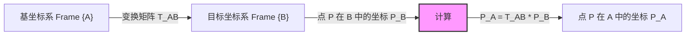

<!-- Generated by the offline translation workflow.
Source: 02-机器人基础和控制、手眼协调/01机器人空间描述与坐标变换.md
Source SHA-256: dfb2d0dcab8d8c91347a2f3dd3f207b667432ba91afabc21a1e8a998aa2858c2
Model: tencent/Hy-MT2-1.8B-GGUF:Q4_K_M
Review machine-translated technical claims before relying on them.
-->
#### 1. Introduction

In robotics, describing an object's position and pose in space is the foundation for all subsequent analyses. This module details how to use rotation matrices and translation vectors to describe rigid body motion, and how to combine them using a **homogeneous transformation matrix**.

#### 2. Core Theory

##### 2.1 Rotation Matrix

Rotation in two-dimensional or three-dimensional space can be described by an orthogonal matrix. Taking rotation of $\theta$ degrees around the $Z$ axis as an example, the rotation matrix $R_z(\theta)$ is:

$$R_z(\theta) = \begin{bmatrix} \cos\theta & -\sin\theta & 0 \\ \sin\theta & \cos\theta & 0 \\ 0 & 0 & 1 \end{bmatrix}$$

##### 2.2 Homogeneous Transformation Matrix

To unify rotation ($R, 3\times3$) and translation ($P, 3\times1$) through linear operations, the homogeneous transformation matrix $T$ of $4\times4$ was introduced:

$$T = \begin{bmatrix} R & P \\ 0 & 1 \end{bmatrix} = \begin{bmatrix} r_{11} & r_{12} & r_{13} & p_x \\ r_{21} & r_{22} & r_{23} & p_y \\ r_{31} & r_{32} & r_{33} & p_z \\ 0 & 0 & 0 & 1 \end{bmatrix}$$

#### 3. Architecture Flow (Mermaid)




#### 4. Python code verification

The following code demonstrates how to use `numpy` to construct a homogeneous transformation matrix and transform a point from the local coordinate system to the global coordinate system.


```python
import numpy as np

def get_rotation_z(theta_deg):
    """生成绕Z轴的旋转矩阵"""
    theta = np.radians(theta_deg)
    c, s = np.cos(theta), np.sin(theta)
    return np.array([
        [c, -s, 0],
        [s,  c, 0],
        [0,  0, 1]
    ])

def get_homogeneous_matrix(R, P):
    """组合旋转和平移生成4x4齐次变换矩阵"""
    T = np.eye(4)
    T[:3, :3] = R
    T[:3, 3] = P
    return T

# --- 场景模拟 ---
# 机器人末端坐标系 {B} 相对于基坐标系 {A}:
# 1. 绕 Z 轴旋转 90 度
# 2. 沿 X 轴平移 2 米, 沿 Y 轴平移 1 米

# 1. 定义旋转和平移
R_AB = get_rotation_z(90)
P_AB = np.array([2, 1, 0])

# 2. 构建变换矩阵 T_AB
T_AB = get_homogeneous_matrix(R_AB, P_AB)

# 3. 定义末端上的一个点 P (在 {B} 系中坐标为 [1, 0, 0])
P_B = np.array([1, 0, 0, 1]) # 齐次坐标

# 4. 计算该点在基坐标系 {A} 中的位置
P_A = T_AB @ P_B

print("变换矩阵 T_AB:\n", T_AB)
print("-" * 30)
print(f"点在局部坐标系 B: {P_B[:3]}")
print(f"点在全局坐标系 A: {P_A[:3]}")

# 预期结果分析:
# B系旋转90度后，B的X轴指向A的Y轴。
# B的原点在A的(2,1)。
# B系中的点(1,0)即沿B的X轴走1米，相当于沿A的Y轴走1米。
# 所以最终位置应该是 (2, 1+1) = (2, 2)。
```
